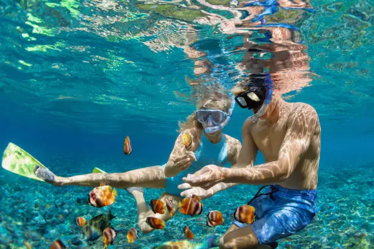

# 🌿 React-Landing – Ecoturismo en Colombia  

[](https://reactjs.org/)  
[](https://tailwindcss.com/)  
[](https://vitejs.dev/)  
[](LICENSE)  
[]()  

Un sitio web dinámico y totalmente responsive para una empresa de **ecoturismo en Colombia**, construido con **React + Vite + Tailwind CSS**.  
El proyecto busca modernizar la forma en que se muestran los destinos turísticos del país, ofreciendo una experiencia visual atractiva y fácil de usar.  

---

## ✨ Características principales  

- 🎨 **Diseño dinámico e interactivo**: tarjetas animadas que cambian de tamaño y se desplazan según el botón seleccionado.  
- 🌍 **Explora Colombia**: acceso a las **6 regiones del país**, cada una con destinos turísticos propios.  
- 🏢 **Sección "Nosotros"**: información de la empresa y su misión.  
- 📩 **Formulario de contacto seguro**: validaciones contra ataques y mal uso.  
- 📂 **Contenido totalmente dinámico**: toda la información proviene de un único archivo `info.jsx`.  
- 📱 **Responsive Design**: adaptado a cualquier dispositivo.  
- 🖼 **Optimización de recursos**: imágenes convertidas a formato `.webp`.  
- 🦶 **Footer global**: presente en todas las páginas excepto en la de inicio.  

---

## 🚀 Estado del proyecto  

✅ **Terminado** – listo para despliegue en **GitHub Pages**.  

---

## 🛠️ Requisitos previos  

Antes de ejecutar este proyecto necesitas tener instalado:  

- [Node.js](https://nodejs.org/) (>= 16)  
- npm (incluido con Node.js)  

Dependencias principales:  

- `react` + `react-dom`  
- `react-router-dom`  
- `tailwindcss@3`  
- `react-hook-form`  
- `gh-pages`  

---

## ⚡ Instalación y ejecución  

Clonar el repositorio:  

```bash
git clone https://github.com/<<<<< TU_USUARIO_DE_GITHUB >>>>>/React-Landing.git
cd React-Landing

Instalar dependencias:

npm install


Iniciar en modo desarrollo:

npm run dev


Construir versión para producción:

npm run build


Desplegar en GitHub Pages:

npm run deploy

📂 Estructura de carpetas
📁 React-Landing
 ├📁 public/         # Archivos estáticos (imágenes, íconos, etc.)
 ├📁 src/            # Código fuente
 │ ├📁 Components/   # Componentes reutilizables
 │ ├📁 Contexts/     # Contextos de React (estado global)
 │ ├📄 App.jsx       # Componente raíz
 │ ├📄 index.css     # Estilos globales
 │ └📄 main.jsx      # Punto de entrada
 ├📄 vite.config.js  # Configuración de Vite
 ├📄 tailwind.config.js # Configuración de Tailwind
 ├📄 package.json    # Dependencias y scripts
 └📄 README.md       # Documentación

⚙️ Configuración de entorno
vite.config.js
import { defineConfig } from 'vite'
import react from '@vitejs/plugin-react'

export default defineConfig({
  plugins: [react()],
  base: "/React-Landing/",
})

tailwind.config.js
module.exports = {
  content: ["./src/**/*.{js,jsx,ts,tsx}"],
  theme: {
    extend: {
      screens: {
        xs: "345px",
        sm: "430px",
        md: "780px",
        tablet: "1220px",
        xl: "1400px"
      },
      animation: {
        downgrade: "downgrade 1s ease-in-out",
        upgrade: "downgrade 1s ease-in-out reverse",
        downGrowCard: "downGrowCard 1s ease-in-out",
        upGrowCard: "upGrowCard 1s ease-in-out",
        infoAppear: "infoAppear 1s forwards var(--delay-anim)",
        infoDisappear: "infoDisappear 1s",
        movement:"movement 6s linear infinite"
      }
    },
  },
  plugins: [],
}

🌿 Inspiración


Este proyecto nació de la necesidad de mejorar las páginas de turismo en Colombia, que suelen ser sencillas y poco atractivas.
Mi objetivo es que alguna empresa del sector vea el potencial y pueda convertirse en una oportunidad laboral.

📬 Contacto

📧 Correo: <<<<< nievesarrietawalter@gmail.com >>>>>
🌐 GitHub: [<<<<< Walter Nieves >>>>>](https://github.com/
<<<<< Walter Nieves >>>>>)

⭐ Apoya este proyecto

Si te gustó este proyecto, por favor considera:

Darle una ⭐ en GitHub

Compartirlo con otros

Dejarme tu feedback


 
